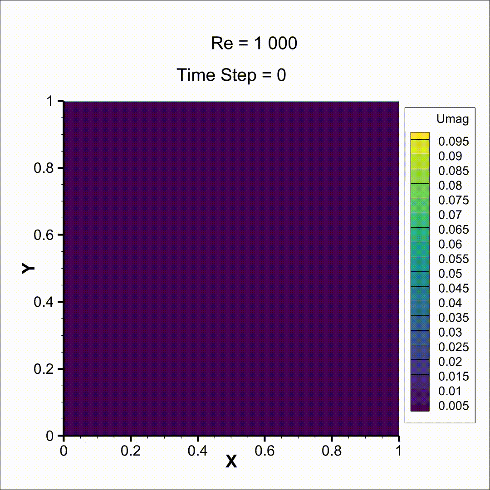
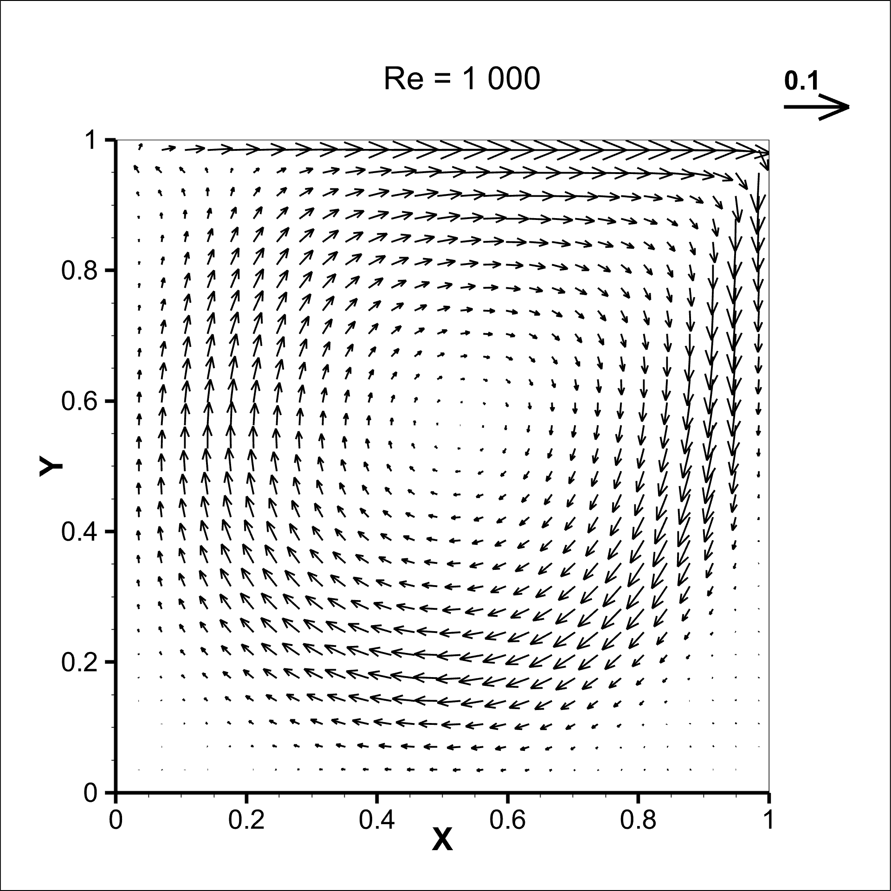
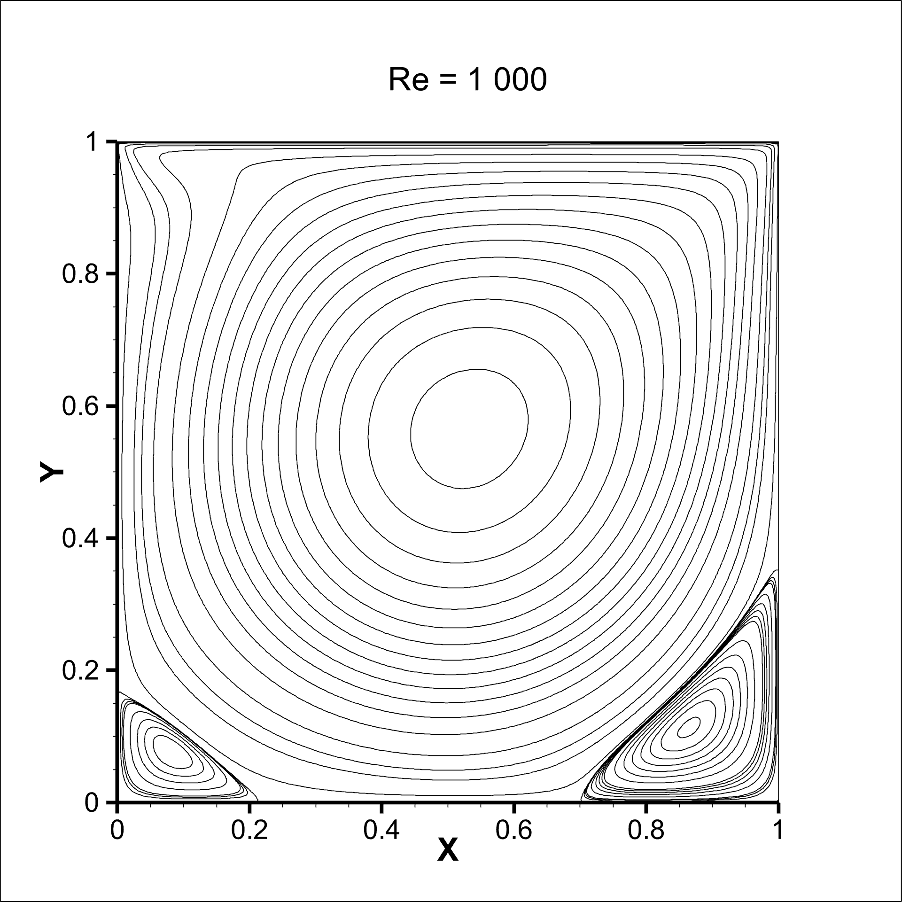
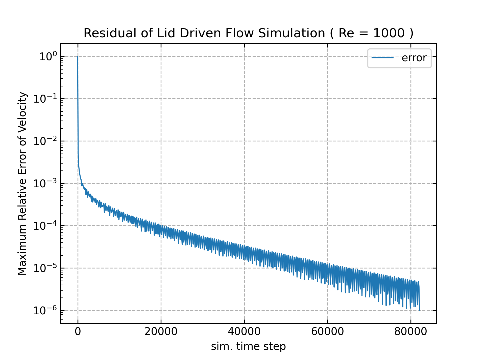

# openmp_parallel_lbm

Accelerating LBM by using openmp parallel.

## lid driven cavity (Re = 1000.0)

- flow field developments with time

  

- velocity vector at steady state

  

- streamline at steady state

  

- relative error during calculation

  

